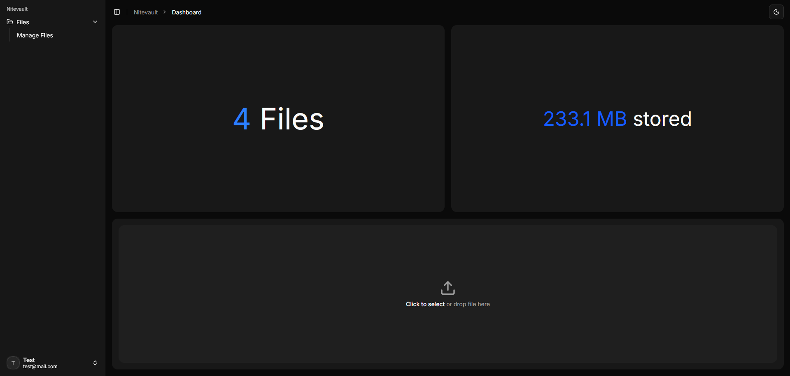
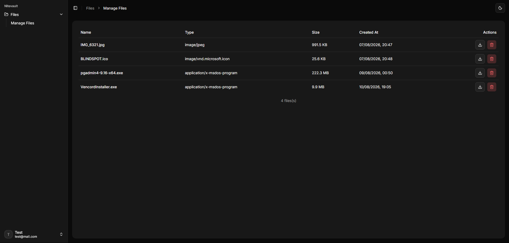

# Nitevault

Self-hosted file storage that uses Telegram as the storage backend. Files are uploaded to a private Telegram channel through a bot, and Nitevault keeps track of everything through its own API and web interface.

## What you need before starting

- [Docker](https://docs.docker.com/get-docker/) and Docker Compose
- A Telegram account
- A few minutes to set up a bot and a storage channel (walkthrough below)

## Quick overview




Nitevault is made of these pieces, all started together via Docker Compose:

- **frontend** — the web interface (http://localhost:3000)
- **api** — the backend (http://localhost:5172)
- **postgres** — database
- **redis** — used for sessions and short-lived download tokens
- **telegram-bot-api** — a self-hosted Telegram Bot API server (needed to bypass the public API's smaller file size limits)
- **bot-api-cleanup** — prunes the bot API's local file cache daily

You don't need to install .NET, Node, or Bun locally to run Nitevault — everything runs inside containers.

---

## Step 1 — Get a Telegram api_id / api_hash

Go to [my.telegram.org](https://my.telegram.org) and log in with your phone number.

Click **API Development Tools**.

Fill the form with any info you like (app title: `myNitevault`, short name: `nitevault123`, platform: `Other` or `Server` — none of this affects functionality).

Submit — you'll get an `api_id` (number) and `api_hash` (string). Keep these handy, you'll add them to your `.env` file in Step 5.

---

## Step 2 — Create the bot

Open `@BotFather` on Telegram.

Send `/newbot`.

Give it a display name (e.g. `Nitevault Storage`).

Give it a username ending in `bot` (e.g. `nitevault_storage_bot`).

BotFather replies with a token — keep this handy too, it goes in `.env` as `BOT_TOKEN`.

---

## Step 3 — Create the storage channel and add the bot

Create a new Telegram channel (it can be private) — this is where all uploaded files will actually live.

Add the bot as an **administrator** of the channel (Channel settings → Administrators → Add Admin → search the bot's username).

This step matters: without admin rights, the bot can't post to the channel, and later can't delete messages either.

---

## Step 4 — Set up your `.env` file

Copy the example file:

```bash
cp .env.example .env
```

Open `.env` and fill in what you already have:

```
JWT_KEY=              # any random 32+ character string, e.g. from https://passwords-generator.org/32-character
DATABASE_URL=Host=postgres;Port=5432;Database=nitevault;Username=nitevault;Password=nitevault
REDIS_CONNECTION=redis:6379
TELEGRAM_API_ID=      # from Step 1
TELEGRAM_API_HASH=    # from Step 1
BOT_TOKEN=            # from Step 2
CHAT_ID=              # you'll get this in Step 6, leave blank for now
```

You can change the Postgres username/password if you want, just make sure `DATABASE_URL` matches.

---

## Step 5 — Start the self-hosted bot API server

```bash
docker compose up -d telegram-bot-api
```

Check the logs to confirm it started cleanly (no `check_required_env` errors):

```bash
docker compose logs telegram-bot-api
```

Confirm the server is reachable and the bot is recognized:

```bash
curl http://localhost:8081/bot<BOT_TOKEN>/getMe
```

This should return `"ok":true` along with the bot's info. If it doesn't, double check `TELEGRAM_API_ID`/`TELEGRAM_API_HASH`/`BOT_TOKEN` in your `.env`.

---

## Step 6 — Get the channel's chat_id

Send any message in the channel manually (from your own account).

Call:

```bash
curl http://localhost:8081/bot<BOT_TOKEN>/getUpdates
```

Look for `"chat":{"id": -100...}` in the response (channel posts appear under `channel_post`, not `message`).

That negative number is the `chat_id` — set it in `.env`:

```
CHAT_ID=-100...
```

> `getUpdates` only returns updates it hasn't returned before (long-polling semantics). If the response comes back empty, send a fresh message in the channel and call it again.

---

## Step 7 — Validate the pipeline (optional, but recommended)

Send a test message:

```bash
curl -X POST http://localhost:8081/bot<BOT_TOKEN>/sendMessage \
  -H "Content-Type: application/json" \
  -d '{"chat_id": <CHAT_ID>, "text": "Nitevault test"}'
```

Send a test file:

```bash
curl -X POST http://localhost:8081/bot<BOT_TOKEN>/sendDocument \
  -F "chat_id=<CHAT_ID>" \
  -F "document=@/path/to/test/file"
```

If both show up in the channel, the bot setup is fully working end to end.

---

## Step 8 — Bring the whole stack up

```bash
docker compose up --build
```

This builds and starts everything: `postgres`, `redis`, `telegram-bot-api`, `bot-api-cleanup`, the `api` (which automatically applies database migrations on startup), and the `frontend`.

Once it's up:

- **App**: http://localhost:3000
- **API**: http://localhost:5172

Create an account from the sign-up page and start uploading files.

---

## Everyday use

Once set up, starting the app again is just:

```bash
docker compose up -d
```

To stop everything:

```bash
docker compose down
```

To rebuild after pulling new changes:

```bash
docker compose up --build
```

---

## Troubleshooting

**Bot can't post to the channel** — make sure it's an admin, not just a member.

**Files older than 48h can't be deleted** — this is a Telegram platform limit on bot-sent messages, not a Nitevault bug. Deleting a file still removes it from Nitevault; the underlying Telegram message may remain.

**`telegram-bot-api` logs show `check_required_env`** — `TELEGRAM_API_ID`/`TELEGRAM_API_HASH` are missing or wrong in `.env`.

---

## ⚠️ Security notes

- If your bot token is ever exposed, revoke it immediately via `@BotFather` → `/mybots` → API Token → Revoke.
- The `api_id`/`api_hash` pair is tied to your personal Telegram account. If you're running this at any real volume, consider using a secondary phone number to isolate risk from your main account.
- Change the default Postgres username/password before deploying anywhere beyond your own machine.

## ❗ Disclaimer

The author is not responsible in any way for account bans or breaking Telegram`s TOS. Use at your own risk.
